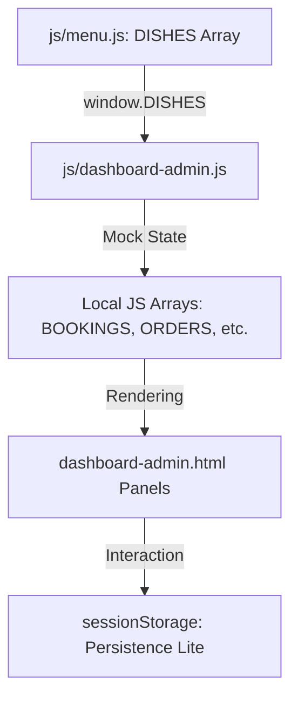

# Admin Dashboard: Backend Migration Guide (ASP.NET MVC)

This document explains the architecture of the current static Admin Dashboard and provides a roadmap for migrating it to a **C# ASP.NET MVC** backend.

## 1. Current Architecture Overview

The dashboard currently operates as a "Single Page Application" (SPA) Lite. It uses static JavaScript arrays as a mock database and renders HTML dynamically into "panels" based on user interaction.

### Data Flow Diagram

---

## 2. Mock Data Structures
These are the objects you will need to turn into **C# Models**.

### Menu Manager (`adminMenu`)
Currently a clone of `DISHES` with extra fields.
- **Fields**: `id`, `name`, `price`, `available` (boolean), `discount` (int).
- **ASP.NET Suggestion**: Create a `Dish` model and a `MenuViewModel` that includes inventory status.

### Table Gatekeeper (`BOOKINGS`)
- **Fields**: `id`, `guest`, `time`, `covers`, `occasion`, `table`, `status` (confirmed/seated/cancelled).
- **ASP.NET Suggestion**: Create a `Booking` model with an `Enum` for status.

### Live Orders (`LIVE_ORDERS`)
- **Fields**: `id`, `customer`, `dishes` (List/Array), `total`, `placed`, `status` (new/preparing/ready/delivered).
- **ASP.NET Suggestion**: Create an `Order` model and an `OrderItem` join table.

---

## 3. How Rendering Works
The dashboard uses "Lazy Rendering" for performance.

1.  **Panel Switching**: The `showPanel(name)` function hides all `.admin-panel` divs and shows the one matching the `data-panel` attribute.
2.  **JS Templating**: Functions like `renderMenuTable()` or `renderKanban()` loop through the arrays and build HTML strings using Template Literals (`` `...` ``).
3.  **Injection**: The generated HTML is injected into specific container IDs (e.g., `document.getElementById('menuTableBody').innerHTML = ...`).

---

## 4. State & Persistence
Since there is no real database yet, we use **Session Storage** to keep track of changes (like toggling an item "Out of Stock").

- **Save**: `sessionStorage.setItem('olives_admin_stock', JSON.stringify(map))`
- **Load**: `JSON.parse(sessionStorage.getItem('olives_admin_stock'))`

**Migration Tip**: In ASP.NET MVC, these operations will become `POST` or `PUT` requests to your Controllers, which will then update your SQL Database (via Entity Framework).

---

## 5. Migration Roadmap to ASP.NET MVC

### Step 1: Define Models
Create C# classes in your `/Models` folder for `Dish`, `Booking`, `Order`, and `Customer`.

### Step 2: Set up a Database Context
Use Entity Framework Core (EF Core) to map these models to a SQL Server or SQLite database.

### Step 3: Create Controllers
- `AdminController`: Handle the main dashboard view.
- `MenuController`: Handle CRUD operations for the menu.
- `OrderController`: Manage live order statuses.

### Step 4: Refactor HTML to Razor Views
Convert `dashboard-admin.html` into a `Dashboard.cshtml` view. Replace the JS `innerHTML` injection with server-side `@foreach` loops where possible, or use **AJAX/Fetch** to get JSON data from your controllers.

### Step 5: Replace Local Storage with API Calls
In `js/dashboard-admin.js`, instead of reading from `sessionStorage`, you will use `fetch('/api/menu/update')` to talk to your C# backend.

---

> [!TIP]
> Keep the current CSS classes (`a-panel`, `kpi-card`, `bk-table`) exactly as they are. They are highly decoupled from the data logic, making it easy to wrap them in Razor syntax or Blazor components later.
